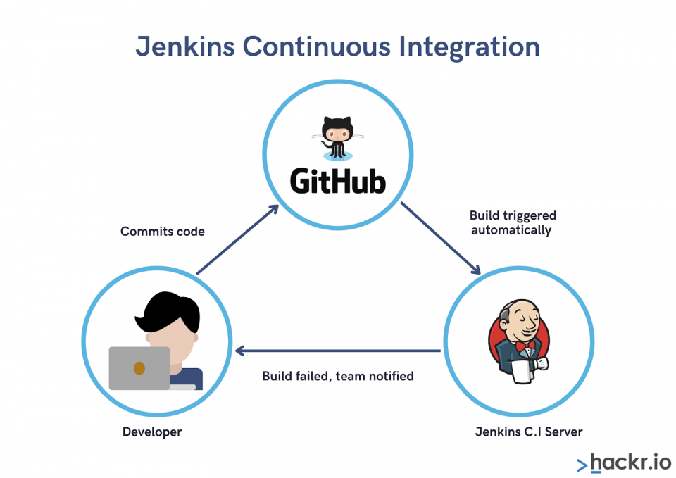

# CI-CD-on-DevOps-Website-Solution
## Introduction
Jenkins is an open-source Continuous Integration server written in Java for orchestrating a chain of actions to achieve the Continuous Integration process in an automated fashion. Jenkins supports the complete development life cycle of software from building, testing, documenting the software, deploying, and other stages of the software development life cycle.


#

Here I introduce Jenkins to automate code delivery to the NFS server


## Jenkins Web Architecture For CI Builds
#
 


## Installing Jenkins Server

Spun up a web server on AWS cloud and SSH into it.

Installing JDK which is an important Java based package required for Jenkins to run.
```
sudo apt update
sudo apt install default-jdk-headless
```


```
wget -q -O - https://pkg.jenkins.io/debian-stable/jenkins.io.key | sudo apt-key add -
sudo sh -c 'echo deb https://pkg.jenkins.io/debian-stable binary/ > \
    /etc/apt/sources.list.d/jenkins.list'
sudo apt update
sudo apt-get install jenkins

sudo systemctl enable jenkins
sudo systemctl start jenkins
sudo systemctl status jenkins
```


Since Jenkins runs on default port 8080, open this port on the Security Group inbound rule of the jenkins server on AWS 


Jenkins is up and running, copy and paste jenkins server public ip address appended with port 8080 on a web server to gain access to the interactive console. `<jenkins_server_public_ip_address>:8080`


The admin password can be found in the `'/var/lib/jenkins/secrets/initialAdminPassword'` path on the server.


